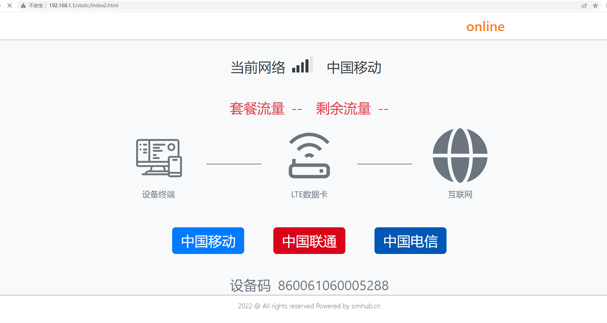

# QuecPython Web Server 解决方案

中文 | [English](readme.md)

## 简介

这是一个 QuecPython web  server 方案的软件框架。

## 用法

将 [`web_simhub`](./web_simhub) 文件夹下的所有文件导入到模组的文件系统后，[`main.py`](./web_simhub/main.py) 文件将自动运行，启动web服务。

Web 页面访问地址：<http://192.168.1.1/static/index.html>。

效果图如下所示：

## 贡献

我们欢迎对本项目的改进做出贡献！请按照以下步骤进行贡献：

1. Fork 此仓库。
2. 创建一个新分支（`git checkout -b feature/your-feature`）。
3. 提交您的更改（`git commit -m 'Add your feature'`）。
4. 推送到分支（`git push origin feature/your-feature`）。
5. 打开一个 Pull Request。

## 许可证

本项目使用 Apache 许可证。详细信息请参阅 [LICENSE](LICENSE) 文件。

## 支持

如果您有任何问题或需要支持，请参阅 [QuecPython 文档](https://python.quectel.com/doc) 或在本仓库中打开一个 issue。
